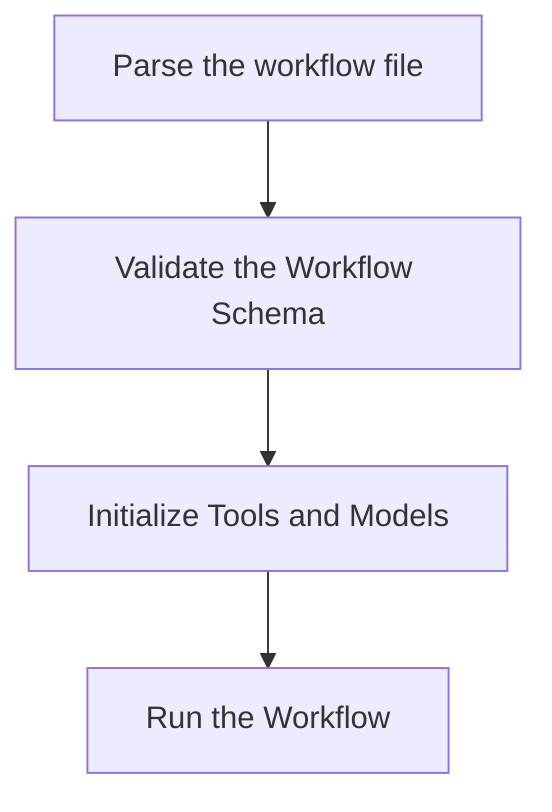

# Proposal implementation for the Run Command

## mf run

Runs a workflow

```text
mf run [flags] WORKFLOWNAME
```

## Options

```text
    -h, --help   help for run
    --dry-run    Dry run the workflow
    --verbose    Verbose output
```

## Design V0

Run the workflow in the following sequence of steps:



For simplicity, workflow steps will be run in sequence. In the future, we can allow for more dynamic pipelines: see [Future improvements](#future-improvements).

The implementation should create a pipeline to run the workflow. As we validate the workflow schema.

### Pros

By following this sequence, we ensure that the workflow is valid and that the tools and models are initialized correctly before running the workflow. This approach attempts to minimize the chances of errors during the workflow run, which could potentially result in partial or incorrect results. This step should be efficient as it is only static analysis of a relatively small file.

### Cons

The workflow may take longer to start running as it has to go through the validation and initialization steps. Before running any actions. 

### Tasks

- [x] Parse the workflow file (YAML)
- [ ] Validate the Workflow Schema
- [ ] Initialize Tools and Models
- [ ] Create a pipeline to run the workflow

### Considerations

Should we prune any tools or models not used in the workflow? This could be a future optimization.


### Future improvements

- [ ] Allow for parallel execution of steps
- [ ] Allow for looping
- [ ] Allow for conditional execution of steps
- [ ] Allow for dynamic generation of steps, tools, models, and actions
- [ ] Allow for user input during the workflow run
- [ ] Allow for user-defined functions to be used in the workflow

