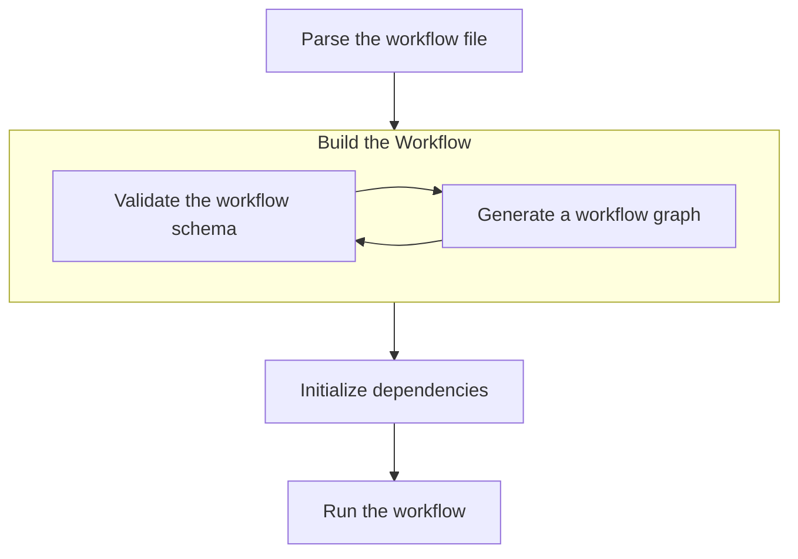

# Proposal implementation for the Run Command

## mf run

Runs a workflow

```text
mf run [flags] WORKFLOWNAME
```

## Options

```text
    -h, --help   help for run
    --verbose    Verbose output
```

## Design V0.1

Run the workflow in the following sequence of steps:



For simplicity, workflow steps will be run in sequence. In the future, we can allow for more dynamic pipelines: see [Future improvements](#future-improvements).

### Pros

By following this sequence, we ensure that the workflow is valid and that the tools and models are initialized correctly before running the workflow. This approach attempts to minimize the chances of errors during the workflow run, which could potentially result in partial or incorrect results. This step should be efficient as it is only static analysis of a relatively small file.

### Cons

The workflow may take longer to start running as it has to go through the validation and initialization steps. Before running any actions. 

### Tasks

- [x] Parse the workflow file (YAML)
- [x] Validate the Workflow Schema
- [x] Initialize Tools and Models
- [x] Run the Workflow Steps

### Considerations

- Can users re-run failed steps? This could be a future feature.
- What happens if the user tries to interpret in the middle of a workflow run?


### Future improvements

- [ ] Containerize workflows to avoid modifying the user's environment or system, and make it easier to throw away the environment after or during the workflow run
- [ ] Allow for parallel execution of steps
- [ ] Allow for looping
- [ ] Allow for conditional execution of steps
- [ ] Allow for dynamic generation of steps, tools, models, and actions
- [ ] Allow for user input during the workflow run
- [ ] Allow for user-defined functions to be used in the workflow
- [ ] Prune the workflow graph to remove unnecessary items

